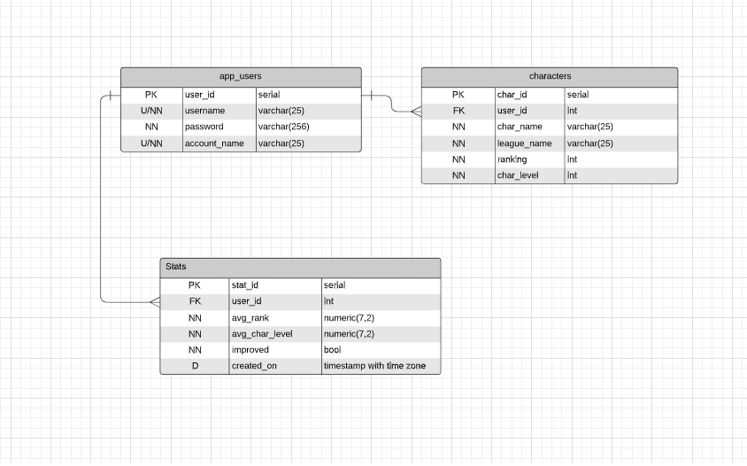

# Juan_Valencia_p0
Rank Analyzer API 

This API in conjuction with the Path of Exile Ladder API.

The goal of this API is to retrieve the characters that made it to the top of the ladder( Top Ranking positions capped at 15,000 ) of previous and current leagues (seasons that have a ladder reset every 3 or so months ) with the objective to provide an average rank score, an average character level of the overall league and if the player has improved from previous rankings analyzed. 

GET /users - It will retrieve all of the store users with their id, username , password, and account name (Their Path of Exile account name). Only visible to the admin(AG) that has an established session.

GET /users/:id - Provides a single user by their id.

POST /users - Adds a new username password and account name to the database if it wasn't already inserted.

PUT /users - updates their password or account name. username is not allowed. (AG)

DELETE /users - deletes a user by their id. It will call a trigger to delete any conflicting relationships. Will throw a 204 regardless if it was in the table or not. (AG)

GET /characters - Retrieves all characters that have been persisted. Available for all users.

GET /characters/:id - Retrieves characters by user id.

POST /characters - With an account name and the league name it will call the external API using axios, persists all the characters retrieved, and does calculations on said instance to persist to the stat table. (Doing it this ways prevents back and forth connection calls to iterate thru each record).

PUT /characters - updates ranking and character level using the character id.

DELETE /characters - deletes all characters own by said user. ( For testing purposes, this will get change to be delete by league name).

GET /Stats - Retrieves all the stats with a column of when the characters were retrieved/stats-created.

ERD -- 
